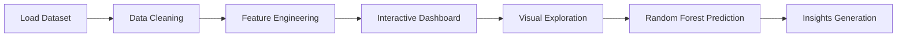

# 📸 Demo

<!-- Replace with your own screenshot -->


🔗 **Live Demo:**
https://your-streamlit-deploy-url

---

# 📋 Table of Contents

* [Description](#-description)
* [Features](#-features)
* [Technologies](#-technologies)
* [Installation](#-installation)
* [Usage](#-usage)
* [Project Structure](#-project-structure)
* [Application Flow](#-application-flow)
* [What I Learned](#-what-i-learned)
* [Future Improvements](#-future-improvements)
* [Author](#-author)

---

# 📖 Description

**Surgical Analytics Pro** is an interactive healthcare analytics dashboard developed to explore surgical procedure outcomes through clinical, economic, and patient experience indicators.

The project combines **descriptive analytics, interactive visual exploration, and a Random Forest predictive model** to investigate patterns and simulate data-driven healthcare decision support.

Built as an educational and portfolio project, the dashboard demonstrates how visual analytics and predictive methods can transform complex surgical data into accessible insights.

---

# ✨ Features

* ✅ Interactive surgical procedure comparison
* ✅ Cost and recovery analysis
* ✅ Patient experience exploration
* ✅ Dynamic filtering and visual storytelling
* ✅ Predictive modeling using Random Forest
* ✅ Interactive data visualizations
* ✅ Premium medical dashboard UI
* ✅ Responsive layout
* ✅ Educational model disclaimer

---

# 🛠️ Technologies

| Technology   | Purpose                        |
| ------------ | ------------------------------ |
| Python       | Core development               |
| Streamlit    | Dashboard framework            |
| Pandas       | Data processing                |
| Plotly       | Interactive visualizations     |
| Scikit-Learn | Random Forest predictive model |
| HTML/CSS     | Premium UI customization       |
| Git & GitHub | Version control                |

---

# ⚙️ Installation

```bash
# Clone repository
git clone https://github.com/nicol-ael/surgical-analytics-pro.git

# Enter folder
cd surgical-analytics-pro

# Install dependencies
pip install -r requirements.txt

# Run application
streamlit run app.py
```

---

# 💡 Usage

1. Launch the application locally or through deployment.
2. Explore available surgical procedures.
3. Analyze metrics including:

   * Procedure cost
   * Recovery period
   * Clinical outcomes
   * Patient experience
4. Navigate through interactive visualizations.
5. Use the predictive section to generate exploratory estimates through the Random Forest model.

> Predictions are educational and generated from a synthetic and simplified dataset.

---

# 📁 Project Structure

```plaintext
surgical-analytics-pro/

├── app.py
├── pages/
│   └── About.py
├── assets/
│   └── demo.png
├── data/
│   ├── synthetic_dataset.csv
│   └── cleaned_dataset.csv
├── models/
│   └── random_forest_model.pkl
├── utils/
│   └── preprocessing.py
├── requirements.txt
└── README.md
```

---

# 🔄 Application Flow



---

# 🎓 What I Learned

* Designing analytical dashboards with a stronger storytelling approach.
* Building custom interfaces in Streamlit using HTML and CSS.
* Training and integrating a **Random Forest model** into an interactive application.
* Understanding the importance of communicating model limitations in healthcare analytics.
* Transforming synthetic healthcare datasets into meaningful visual insights.

---

# 🚧 Future Improvements

* [ ] Integrate real-world clinical datasets
* [ ] Improve Random Forest performance and validation
* [ ] Include additional medical variables
* [ ] Expand interpretability and explainability
* [ ] Add accessibility improvements
* [ ] Deploy production-ready infrastructure

---

# 👤 Author

**Nicol Alejandra Escobar**

🐙 GitHub:
https://github.com/nicol-ael

💼 LinkedIn:
https://www.linkedin.com/in/nicolescobardatayhealthcare/

✉️ Email:
[nicolescobar3330@gmail.com](mailto:nicolescobar3330@gmail.com)

---

## Disclaimer

This project is intended exclusively for educational and exploratory purposes.

The predictive outputs rely on a **Random Forest model trained on synthetic and simplified data** and must not be interpreted as medical advice or used for real clinical decision-making.
